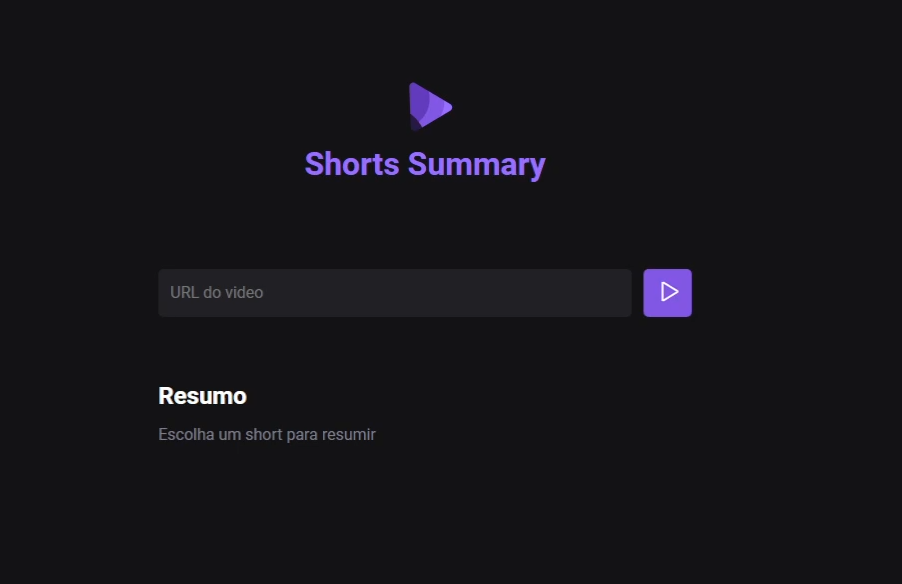

## Sobre o Projeto:

Um projeto feito utilizando Node.js, HTML, CSS e JS em que uma IA irá resumir um short do Youtube com base no áudio. 

## 💻 Tecnologias utilizadas:

- HTML
- CSS
- JavaScript
- Node.js
- Git/Github
- IA (Xenova)

## 🎨 Layout:

- [Figma](https://www.figma.com/file/0MVPh2FgPZNwP3pOoXeYoS/Shorts-Summary-%E2%80%A2-Trilha-Foundations-(Community)?type=design&node-id=0-1&mode=design&t=M94Hpw0JtcxvKPZK-0)